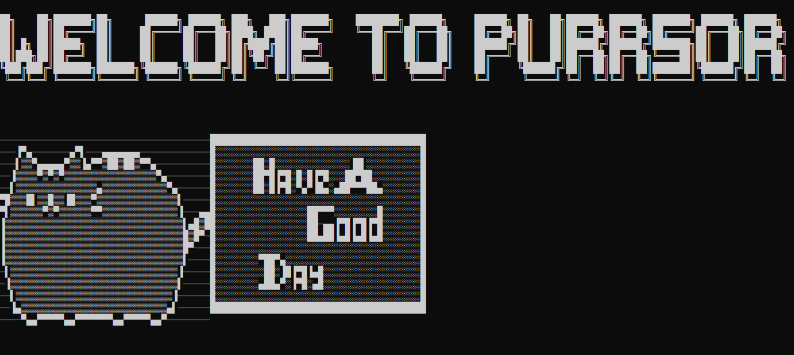

<H1>Welcome to PurrSor Project 🐱🖱</H1> 

It's just a set of fancy cute cats following up your mouse cursor, You can interact with tham and play with them as much you want.
You can choose variety of cats (Totally depends on your personal taste!!).

<H1>Dev/Setup Env to run this program?</H1>
As of now it's only supported for Windows OS 10/11 , and python 3.9 or greater should be pre-installed 
To check python is installed or not -> Open your cmd -> type -> python -V OR python --version 
Listed below libraries should be pre-installed:- 
<ul>
<li>pip install infi.devicemanager</li>
<li>pip install infi</li>
<li>pip install pillow</li>
<li>pip install os-sys</li>
<li>pip install tk</li>
<li>pip install toml</li>
<li>pip install PyYAML</li>
</ul>
<h3>If you face any other ModuleNotFound Error: the try to install those dependencies.</h3>

<H1>How to run this project?</H1>
->Download this entire repo 
->extract the repo (downloaded zip file) 
->open CMD in that extact same folder where all files has been extracted, Note there should be files like :- __init_.py, __main__.py etc. 
->type following command to run program -> python __main__.py 
AND GOOD JOB, YOUR KITTY WILL APPEAR ON SCREEN 

<H1>How to change cats?</H1>
There are lots of cats available, feel free to explore them by the following steps:- 
Here you can see all name of the cats (some of them are not even cats, like alien).  
list of cats = [
    'ace',
    'air',
    'alien',
    'coke-bottle',
    'ghost',
    'holiday',
    'neko',
    'nekocool',
    'neon',
    'pac-man',
    'penguin',
    'penguin-2',
    'pink',
    'rainbow',
    'red-bsd-daemon',
    'robot',
    'rose',
    'silver',
    'silversky',
    'socks',
    'spooky',
    'tabby',
    'usa',
    'valentine',
    'white'
]
  
 If you want to change cat then NOTE any one of the NAMES listed above 
 ->then go to config folder 
 ->there you will find a file name default_config.yml 
 ->open that file and at 2nd last line after animal: give any name you noted previously 
 For example ->  animal: silver , this will give you grey color cat 
 

 

 
 
 
 
 

 <H1 align="center">THANKS !!</H1>
